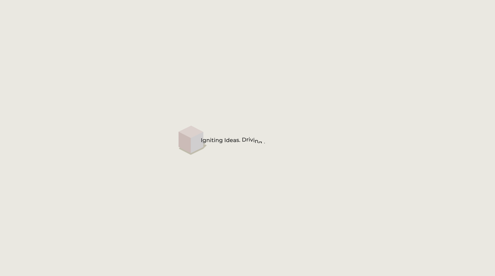
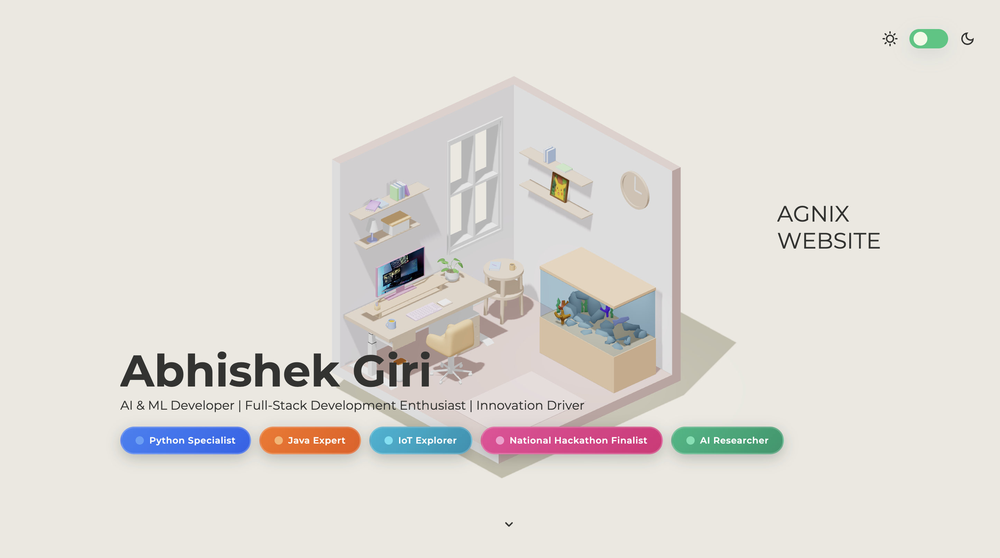
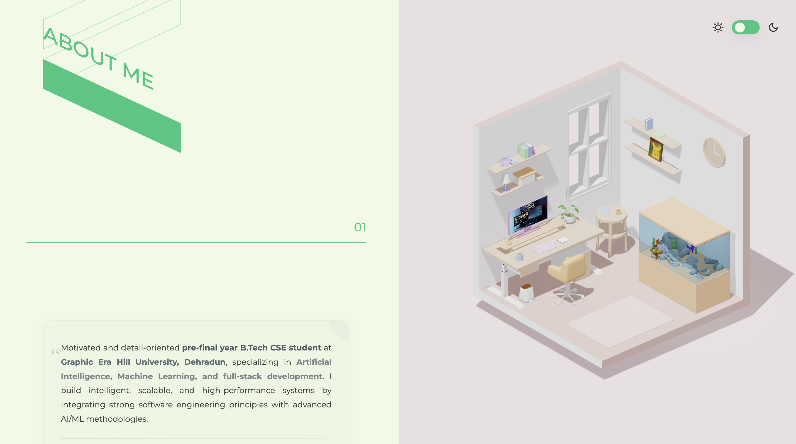
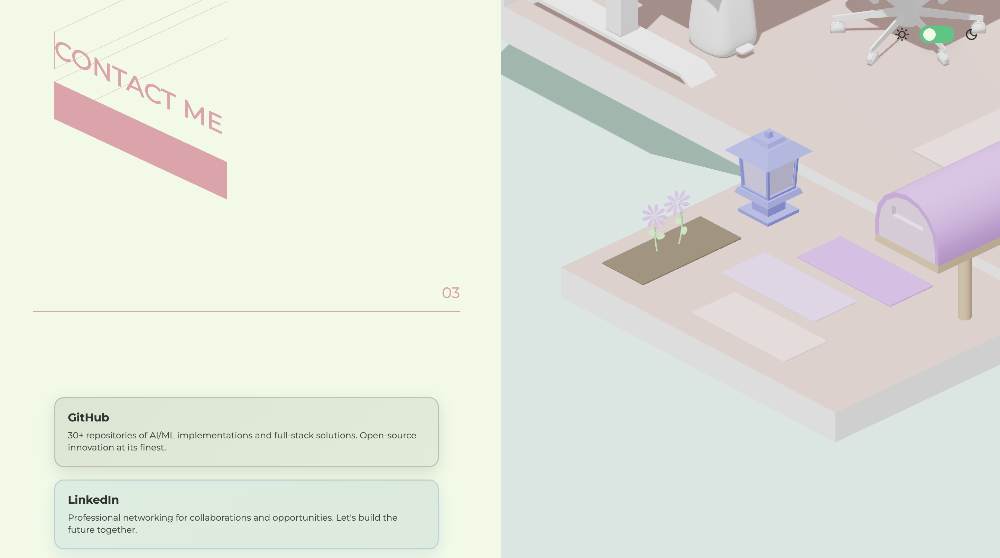

<h1 align="center">🌐 Agnix — Professional AI & ML Developer Website</h1>

<p align="center">
  🚀 Modern interactive website showcasing AI/ML expertise, innovative projects, and professional achievements with stunning 3D visuals and responsive design.
</p>

<p align="center">
  
  
  
  
  
</p>

<br>

---

## 📖 About

Agnix is the official website of **Abhishek Giri**, an AI & ML Developer and Full-Stack Development Enthusiast. This platform showcases cutting-edge technology expertise, innovative projects, and professional achievements in artificial intelligence and machine learning.

<br>

---

## 💡 Highlights

- 🎨 **Interactive 3D Experience** with Three.js and WebGL rendering
- 🌓 **Dark/Light Theme Toggle** with smooth transitions and animations
- 📱 **Fully Responsive Design** optimized for all devices and screen sizes
- ⚡ **Smooth Scroll Animations** with custom parallax effects
- 🎯 **Professional Sections** including About, Work, and Contact
- 🏆 **Skill Badges** with color indicators and hover effects
- 🚀 **Fast Loading** with optimized assets and lazy loading

<br>

---  

## 🚀 Features

✅  **Stunning 3D visuals** with interactive 3D models and animations  
✅  **Smooth scrolling experience** with custom scroll-based animations  
✅  **Theme switcher** for dark and light mode preferences  
✅  **Professional sections** with modern card-based layouts  
✅  **Detailed project showcases** with 5 major AI/ML and full-stack projects  
✅  **Enhanced contact section** with 7 professional networking links  
✅  **Optimized performance** with compressed assets and efficient loading

<br>

---  

## 🛠️ Tech Stack

<div align="center">

<table>
<thead>
<tr>
<th>🖥️ Technology</th>
<th>⚙️ Description</th>
</tr>
</thead>
<tbody>
<tr>
<td></td>
<td>Semantic markup and structure</td>
</tr>
<tr>
<td></td>
<td>Modern styling with custom animations</td>
</tr>
<tr>
<td></td>
<td>Interactive functionality and animations</td>
</tr>
<tr>
<td></td>
<td>3D graphics and WebGL rendering</td>
</tr>
<tr>
<td></td>
<td>Professional animation library</td>
</tr>
<tr>
<td></td>
<td>3D model compression and optimization</td>
</tr>
</tbody>
</table>

</div>

<br>

---

## 📁 Project Directory Structure

```
Agnix/
├── 📂 assets/                      # 🎨 Static assets and resources
│   ├── 📄 index.034a5313.css       # 🎨 Compiled CSS styles (cache-busted)
│   └── 📄 index.b8dab8e6.js        # ⚡ Compiled JavaScript bundle (cache-busted)
├── 📂 docs/                        # 📸 Documentation and screenshots
│   ├── 📄 LoadingPage.png          # ⏳ Loading screen screenshot
│   ├── 📄 HomePage.png             # 🏠 Homepage screenshot
│   ├── 📄 AboutPage.png            # ℹ️ About section screenshot
│   ├── 📄 MyWork.png               # 💼 Work section screenshot
│   └── 📄 ContactPage.png          # 📞 Contact section screenshot
├── 📂 draco/                       # 🗜️ 3D model compression library
│   ├── 📂 gltf/                    # 📦 GLTF-specific decoders
│   │   ├── 📄 draco_decoder.js     # 🔓 Draco decoder for GLTF
│   │   ├── 📄 draco_decoder.wasm   # ⚙️ WebAssembly decoder
│   │   ├── 📄 draco_encoder.js     # 🔐 Draco encoder
│   │   └── 📄 draco_wasm_wrapper.js # 🔄 WASM wrapper
│   ├── 📄 draco_decoder.js         # 🔓 Main Draco decoder
│   ├── 📄 draco_decoder.wasm       # ⚙️ WebAssembly binary
│   ├── 📄 draco_encoder.js         # 🔐 Main Draco encoder
│   ├── 📄 draco_wasm_wrapper.js    # 🔄 WASM wrapper utility
│   └── 📄 README.md                # 📖 Draco documentation
├── 📂 models/                      # 🎭 3D models and assets
│   ├── 📄 Finale Version 16.glb    # 🎨 Main 3D scene model
│   └── 📄 New Boko.glb             # 🎪 Additional 3D model
├── 📂 textures/                    # 🖼️ Texture files and videos
│   └── 📄 kda.mp4                  # 🎬 Background video texture
├── 📄 index.html                   # 🏠 Main HTML entry point
├── 📄 vercel.json                  # ⚙️ Vercel deployment config
├── 📄 .gitignore                   # 🚫 Git ignore rules
└── 📄 README.md                    # 📖 Project documentation
```

<br>

---

## 📸 Preview Images

| 📍 Section                  | 📸 Screenshot                                              |
|:----------------------------|:-----------------------------------------------------------|
| Loading Screen              |           |
| Home Page                   |                    |
| About Section               |           |
| Work Portfolio              |     |
| Contact Information         |     |

<br>

---

## 📦 How to Run

### 📌 Prerequisites
- ✅ **Modern Web Browser** (Chrome, Firefox, Safari, Edge)
- ✅ **Local Web Server** (Python, Node.js, or Live Server)
- ✅ **Git** for cloning repository

<br>

---  

### 🚀 Quick Start

1. Clone the repository:

   ```bash
   git clone https://github.com/AbhishekGiri04/Agnix.git
   cd Agnix
   ```

2. Start a local server:

   **Using Python:**
   ```bash
   python3 -m http.server 8080
   ```

   **Using Node.js:**
   ```bash
   npx serve
   ```

   **Using VS Code Live Server:**
   - Right-click on `index.html`
   - Select "Open with Live Server"

3. Access the website:

   ```
   http://localhost:8080
   ```

<br>

---

<div align="center">

## 🌐 Live Demo

Visit the live website: **[Agnix](https://agnix.vercel.app)**

</div>

<br>

---

## 🚀 Deploy to Vercel

### One-Click Deploy

[](https://vercel.com/new/clone?repository-url=https://github.com/AbhishekGiri04/Agnix)

### Manual Deployment

1. **Connect Repository:**
   - Login to [Vercel](https://vercel.com)
   - Click "Add New" → "Project"
   - Import your GitHub repository
   - Select `Agnix` repository

2. **Build Settings:**
   ```
   Framework Preset: Other
   Build Command: (leave empty)
   Output Directory: .
   Install Command: (leave empty)
   ```

3. **Deploy:**
   - Click "Deploy"
   - Your site will be live in seconds!

### Custom Domain Setup

1. Go to Project Settings → Domains
2. Add your custom domain
3. Configure DNS records as instructed
4. HTTPS is enabled automatically

<br>

---

## 📖 Core Components

* **index.html** — Main HTML structure with semantic markup and SEO optimization
* **index.034a5313.css** — Compiled CSS with custom animations and responsive design
* **index.b8dab8e6.js** — JavaScript bundle with Three.js integration and interactions
* **Finale Version 16.glb** — Primary 3D model with optimized geometry and textures
* **draco/** — 3D model compression library for efficient loading and rendering
* **textures/kda.mp4** — Background video texture for immersive experience
* **vercel.json** — Vercel configuration for SPA routing

<br>

---

## 🎨 Sections Overview

### 🏠 Home
- Hero section with animated introduction
- Interactive 3D background scene
- Professional tagline and skill badges with color indicators
- Smooth scroll indicator

### ℹ️ About Me
- Professional background and expertise with elegant styling
- AI/ML specialization and achievements
- Competition success and certifications (SAARTHI Finalist, MariTHON Finalist, Amazon ML Challenge Global Rank 234)
- Technical skills and career objectives

### 💼 My Work

**Featured Projects:**

1. **CodeSphere** – Real-Time Collaborative Code Editor Platform
   - Live editing, interactive whiteboard, multi-language execution
   - [View Project](https://codesphere-dev.vercel.app)

2. **CareConnect** – Integrated Accessibility Platform
   - IoT-enabled smart home automation with gesture recognition
   - [View Project](https://careconnect-360.vercel.app)

3. **Maritime Intelligence Platform** – AI-Powered SOF Document Processing
   - 95% accurate OCR and NLP event extraction
   - [View Project](https://maritime-intelligence-platform-v1.vercel.app)

4. **HR-GenAI** – AI-Powered Hiring Intelligence Platform
   - AI interviews with 95% accuracy, Digital DNA Profiles
   - [View Project](https://hrgen-dev.vercel.app)

5. **SATYA-DRISHTI** – AI-Powered Content Moderation System
   - 87% accuracy across 12 models, 9 Indian languages
   - [View Project](https://satyadrishti-dev.vercel.app)

6. **AICTE-Edunet Foundation** – AI & Cloud Technology Internship

### 📞 Contact
- GitHub – 30+ repositories
- LinkedIn – Professional networking
- Portfolio – Complete case studies
- LeetCode – 250+ problems solved
- Linktree – All professional links
- Gmail – Direct communication
- Telegram – Instant messaging

<br>

---

## ⚡ Performance Metrics

- **< 2s Load Time** — Optimized assets and lazy loading implementation
- **100% Responsive** — Perfect display on all devices and screen sizes
- **60 FPS Animations** — Smooth 3D rendering and scroll animations
- **Lighthouse Score 95+** — Excellent performance, accessibility, and SEO
- **WebGL Optimized** — Efficient 3D rendering with hardware acceleration
- **Compressed Models** — Draco compression for faster 3D model loading

<br>

---

## 🎯 Key Highlights

- 🐍 **Python Specialist** — Advanced Python development and automation
- ☕ **Java Expert** — Enterprise Java applications and frameworks
- 🔌 **IoT Explorer** — Internet of Things and embedded systems
- 🏆 **National Hackathon Finalist** — Competition excellence and innovation
- 🤖 **AI Researcher** — Continuous research in artificial intelligence

<br>

---

## 🌱 Future Enhancements

- 📱 **Progressive Web App** — Offline support and app-like experience
- 🎬 **Project Case Studies** — Detailed project breakdowns with demos
- 📝 **Technical Blog** — AI/ML tutorials and insights
- 🔐 **Admin Dashboard** — Content management system integration
- 🌍 **Multi-language Support** — Internationalization for global reach
- 📊 **Analytics Integration** — Visitor tracking and engagement metrics

<br>

---  

## 📞 Connect With Me  

> 💬 *Interested in collaboration or have questions?*  
> Let's connect and build something amazing together!

<div align="center">

**👤 Abhishek Giri**  
*AI & ML Developer | Full-Stack Development Enthusiast*

<a href="https://www.linkedin.com/in/abhishek-giri04/">
  
</a>  
<a href="https://github.com/AbhishekGiri04">
  
</a>  
<a href="mailto:abhishekgiri1978@gmail.com">
  
</a>

<br/>

---

**🌐 Built with ❤️ for Innovation and Excellence**  
*Transforming Ideas into Reality Through Technology*

</div>

---

<div align="center">

**© 2026 Agnix - Abhishek Giri. All Rights Reserved.**

</div>
